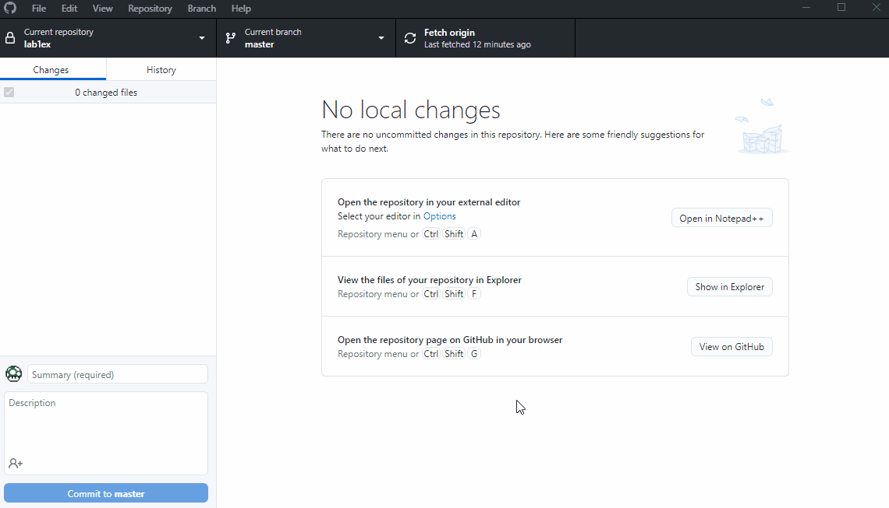
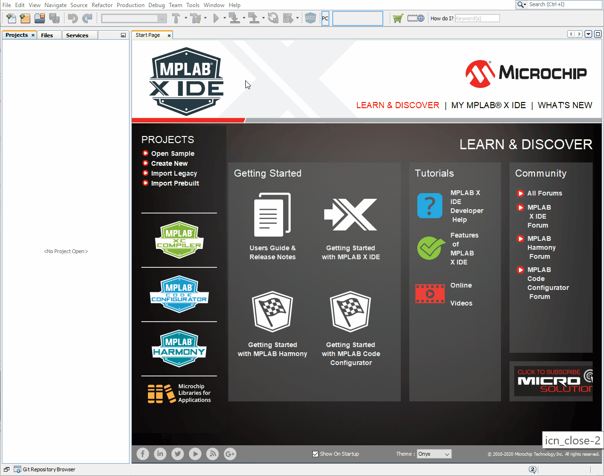
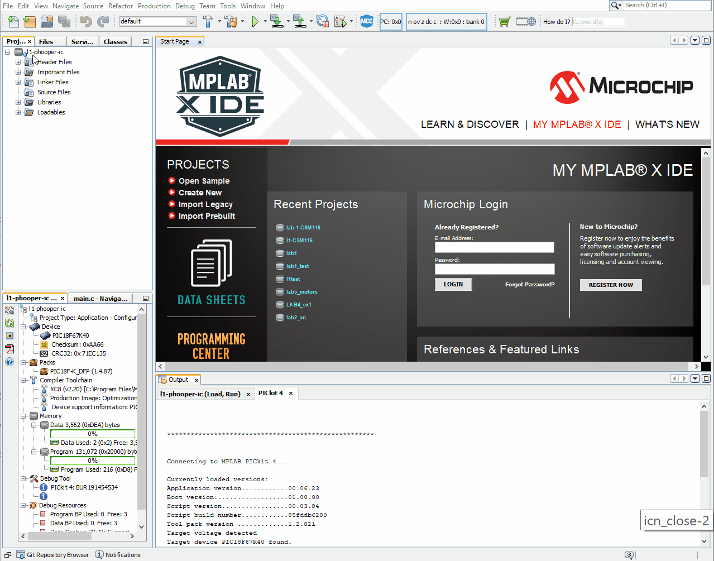
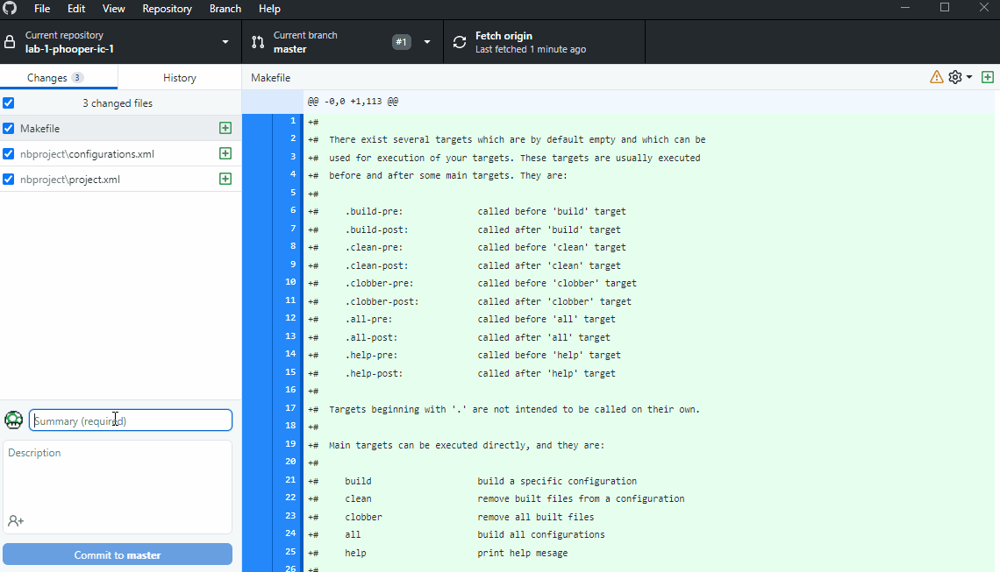

# Lab 1 - Getting started and Digital IO

## Learning outcomes

By the end of this lab you should be able to:
- Compile a C program in MPLAB X and download and run on the PIC chip
- Know the basics of version control with Git (cloning a repository, committing changes, pushing commits to a GitHub remote repository)
- Understand how to control the output of individual pins to control LEDs
- Understand how to poll the state of an input pin connected to a button

## Prerequisites

If you have not already done so, download and install the following:

[MPLAB X IDE](https://www.microchip.com/mplab/mplab-x-ide) - this is the main development environment (scroll down to the Downloads tab and select the download for your system)

[MPLAB XC8 Compiler](https://www.microchip.com/mplab/compilers) - needed to compile code for the microcontroller (scroll halfway down the page and there is a set of tabs, select **Compiler Downloads** tab and choose the XC8 compiler for your system)

[Github desktop](https://desktop.github.com/) - graphical interface for common Git tasks - much better than MPLAB Git integration!

[Git](https://git-scm.com/downloads) - software tools for Git version control (optional but recommended)

## Your first project - the microcontroller "Hello world!"

### Cloning from Github using GitHub Destop:
1. Open up Gitbub desktop applicaiton and sign in
1. Select File -> Clone repository...
1. On the URL tab copy your repository URL i.e. https://github.com/ME3-HECM/labname-gitusername
1. Set the local path for where you store your git repository and add .X to the end of the folder name. Then hit Clone
1. Check that there is now a folder on your hard drive that contains a local copy of the git repo and that the folder name ends with .X

### Creating new MPLAB project:
1. Select Microchip Embedded and Stand-alone Project
1. Select Family Advanced 8bit MCUs (PIC18) and Device PIC18F67K40, if you have connected the PICKIT select it here, if not just leave it as No Tool
1. Select XC8 Compiler
1. The Project Folder box needs to match the folder name of the Git clone. Select directory and enter project name. MPLAB automatically adds .X to the project name 
1. :warning: **Double check** the Project Folder matches the Git folder you created previously and hit finish

### Adding source file and compiling/programming:
1. Right click the source files icon in the projects tab and select add existing item - select main.c
1. Click on the main.c file under the source files icon and open to view/edit the code
1. Hit Build Main Project or Clean and build, the code should compile and you'll see a BUILD SUCCESSFUL message in the output tab
1. Connect the PICKIT to the board and hit Make and Program Device (ensure board is connected to USB and powered on)
1. You should see the LED light up when you press the button
1. Well done :+1:, that's the difficult bit over!

### Working with git and Github Desktop:
Now is a good time to commit your first changes to your local git repository and then push them to the remote repository on GitHub.com

1. In Github Desktop you should see some files automatically created by MPLAB when the project was created. Git automatically identifies any files that have changed in the directory managed by git
1. Write a useful message to go with your commit (i.e "MPLABX Project creation" or similar) 
1. Hit Commit - you're changes are now committed to your local git repository - each commit forms a historical record of changes made to the code
1. To push the changes (commits) to the remote repo on GitHub.com using the Push Origin button
1. Check on GitHub to see your commits online - that's the basic git workflow for source code management. We'll expand on this in more detail later in the module

## Exercises:
After you have got the basic "Hello world!" example working, complete the below exercises. Remember to Commit changes using Git after each exercise and Push the changes to GitHub when complete.

1. Microcontroller "Hello world!" working :white_check_mark:
1. Make the second LED (pin RH3) come on when the other LED (RD7) is not 
1. Enable input on the second button (RF3) and require both buttons to be pressed to change the state of LEDs
1. Change the code so that the each button controls its respective LED
1. Complete the comments in main.c to explain the purpose of each section of code

