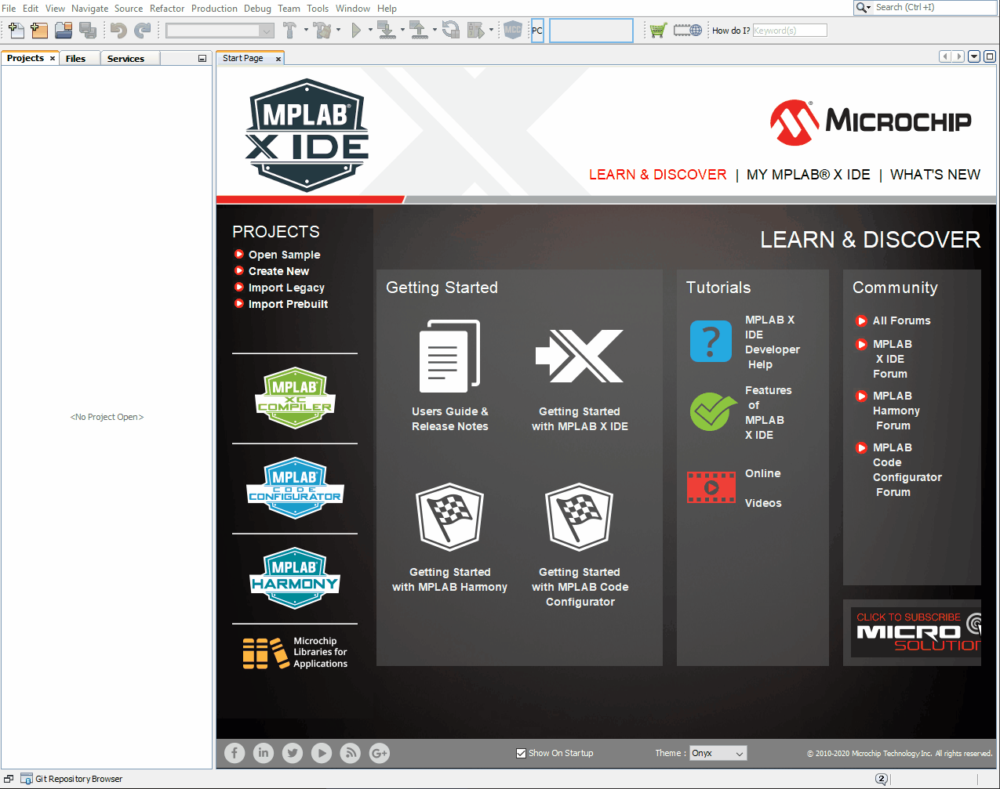
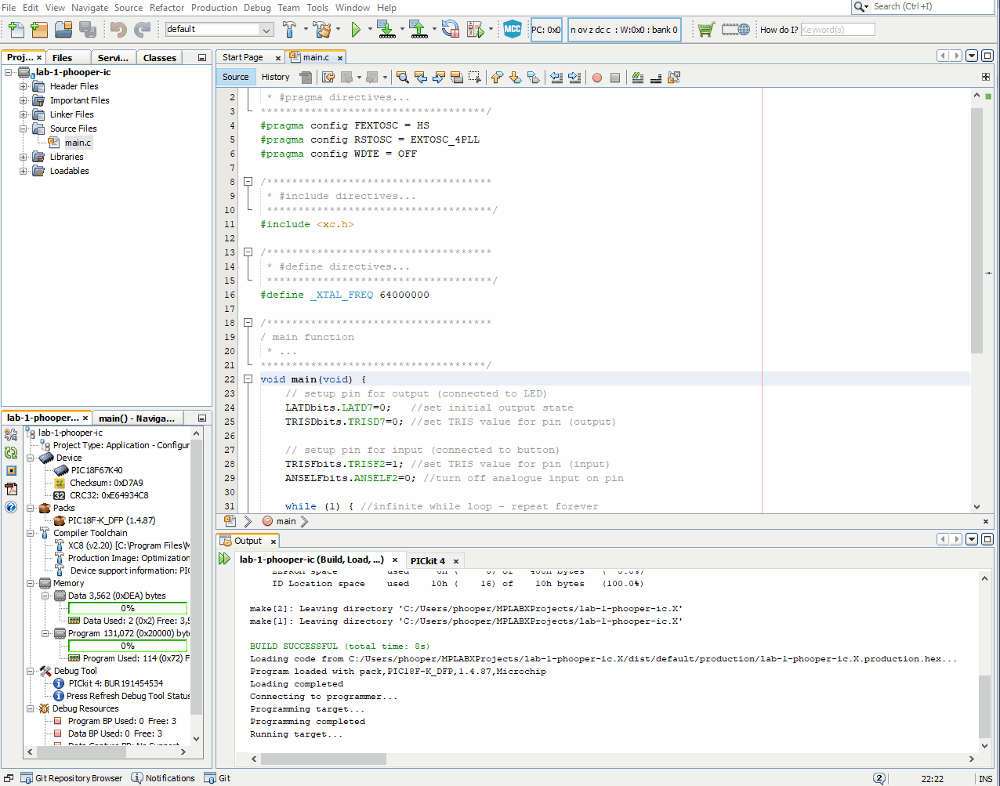

### Old git workflow
This section is not needed, it is only included here for reference in case there are issues with the new Github Desktop workflow.

### Generate a personal access token on GitHub
To increase security GitHub no longer allows the use of your GitHub password to directly access repositories from git (or apps like MPLAB X). This means we must jump through an extra hoop to get things working, but at least we can be more confident that no one will steal/hack our source code! We need to create a personal access token (PAT) on the GitHub site by following the instructions here https://docs.github.com/en/authentication/keeping-your-account-and-data-secure/creating-a-personal-access-token. Use the following options when creating your token:
1. In the **Note** field you can put anything you want - but something like "ECM PAT" will do
1. In **Expiration** put a custom date which extends beyond the end of the course. After this date you will need a new token to access your repos from git (you can still see them on the GitHub site)
1. In scope select the **repo - Full control of private repositories** box
1. Hit **Generate token** and **make a note of the token - you will not be able to see it again**. It is essentially a password and you should treat it as such. I recommend storing it safely in a password mananger. If you lose your token you will need to repeat the above and update all your MPLAB X projects to use it

### Cloning from GitHub using MPLAB:
1. In MPLAB select Team -> Git -> Clone
1. Copy your repository URL i.e. https://github.com/ME3-HECM/labname-gitusername and enter your GitHub email and the PAT that you created above 
1. Hit next (don't worry about the directory for now) and select the master\* branch (should be selected by default)
1. Select a directory to store the cloned repository
1. Add **.X** to the clone name (:warning: **very Important** - your life will be more difficult if you don't do this...)
1. MPLAB should ask you if you want to create a new project, click yes

### Working with git:
Now is a good time to commit your first changes to your local git repository, and then push them to GitHub

1. Right click on the project name in the projects tab and select Git -> Commit...
1. Write a useful message to go with your commit (i.e "MPLABX Project creation"), select author and committer as your GitHub user/email 
1. Hit Commit - you're changes are now committed to your local git repository - each commit forms a historical record of changes made to the code
1. To push the changes (commits) to GitHub, select Git -> Remote -> Push to Upstream
1. Check on GitHub to see your commits online - that's the basic git workflow for source code management, we'll expand on this later in the module

